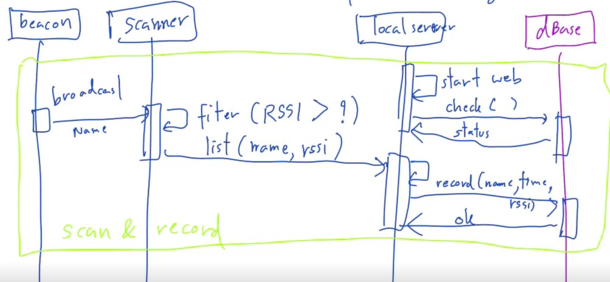

# ict720-project-2025
Repo for demo idea, model, and code for ICT720 course of 2025

## User stories
1. As a **production manager**, I want to **know the status of queue in production lines**, so that **I can evaluate if any issue happens**.
2. As a **production operator**, I want to **register a product to be handled**, so that **I can start working**.
3. As a **production manager**, I want to **know the efficiency of production lines**, so that **I can evaluate the production performance**.

## Software models
### Sequence diagram

## List of student projects
1. [Bro - Hiking](https://github.com/miftahulaziz/ICT720-2025-TeamProject)
   - Mr. Thitikorn Suwannapeng
   - Mr. Natthanon Ratborirak
   - Mr. Miftahul Aziz

2. [Onii chan - Development of Automation System for Wheelchair User](https://github.com/ChutiponTri/ict720-project)
   - Chutipon Trirattananurak
   - Natthapol Sangkool
   - Kazuma Yoshida

3. [BabyCare+](https://github.com/khangnkv/ict720_software_2025)
   - Khang Vinh Khac Nguyen
   - Tanagrid Rakwongrit
   - Waritthorn Na Nagara
     
4. [Toilet paper](https://github.com/Lihour21/ict720-porject-2025)
   - Mr. Chananyu Kamolsuntron
   - Mr. Intouch Wangtrakoondee
   - Mr. Lihour San
  
5. [baby_observation](https://github.com/selavan/ict720_software_2025_TBD)
   - Nattapol TAPTIENG
   - Sela VAN
   - Yanavut CHAWAPHANTH
  
6. [Automatic Machine Stop System for Workplace Safety](https://github.com/Panharithchhom23/ICT720_RTN_Project2025)
   - Puncharus Phongphitthongchai
   - Panharith Chhom
   - Piyapach Singto
  
7. [ProdScan - AI-Based Product Identification System](https://github.com/Rady909/Ict720_software_2025)
   - Thanawin Ungkananuchat
   - Sahatus Asawadilockchai
   - Rady LY
  
8. [Fitness Guys - health-tracking application](https://github.com/thanzawtoe888/ict720-project)
   - Than Zaw Toe (SIIT,Thammasat)
   - Narodom Yatnimit (KU)
   - Duc Nhat Luong ( Institute of Science Tokyo)
